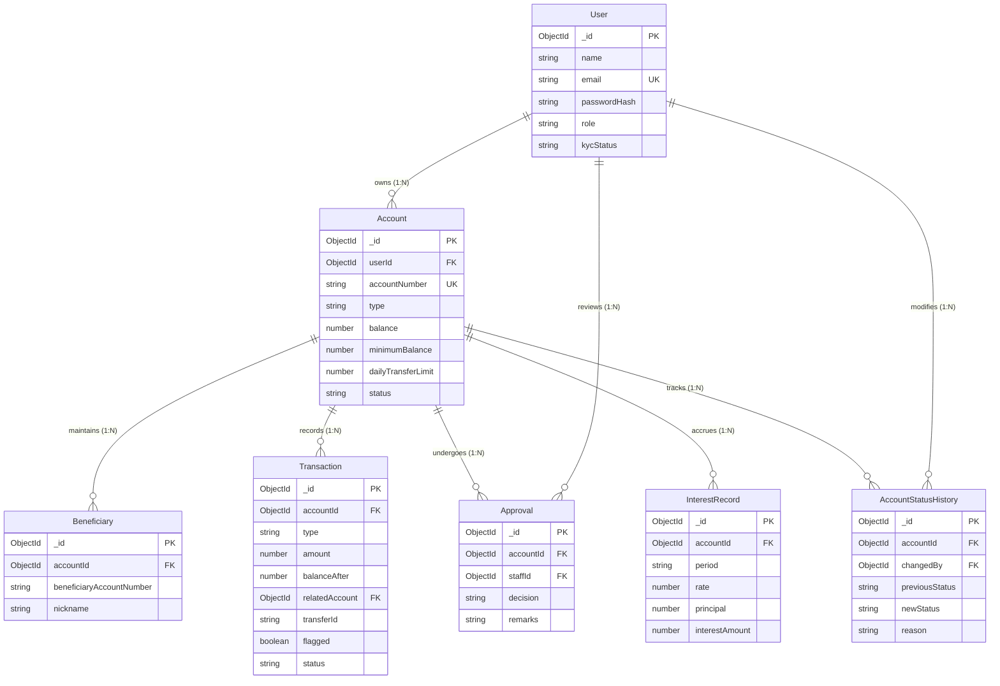

# Digital Banking Account and Transaction Management System (P10)

A secure, audit-compliant core-banking backend system developed for Christ University CIA-3 Project Development (L&T EduTech). Customers can register, complete KYC, open accounts, manage beneficiaries, execute atomic fund transfers, and generate statements. Bank staff can review account applications, monitor suspicious transactions, freeze/unfreeze accounts, trigger interest accrual, and track operational metrics.

---

## 👥 Team Details

| Member | Name | Register Number | Branch / Focus Area | Department | Role & Modules |
| :--- | :--- | :---: | :--- | :--- | :--- |
| **Member 1** | **Darain** | `2462060` | `auth-kyc-accounts` | Computer Science | Customer Onboarding, KYC, Account Creation, Approval Workflow, RBAC (Modules 1, 2, 3, 13) |
| **Member 2** | **Praveen** | `2462066` | `beneficiary-transfer` | Computer Science | Beneficiary Management, Fund Transfer Engine, Limits & Min Balance (Modules 4, 5, 8) |
| **Member 3** | **Bennet** | `2462056` | `ledger-statements-monitoring` | Computer Science | Transaction Ledger, Account Statements, Interest Job, Suspicious Flagging (Modules 6, 7, 9, 11) |
| **Member 4** | **Devananda** | `2462063` | `freeze-dashboard-integration` | Computer Science | Account Freeze/Unfreeze, Staff Monitoring Dashboard, Postman Suite & Integration (Modules 10, 12, Integration) |

---

## 💼 Problem Statement

Modern financial institutions require robust backend infrastructure ensuring absolute data consistency, auditability, and role-based access control. Traditional simplistic CRUD systems fail to prevent race conditions during concurrent money transfers or track immutable audit trails for regulatory compliance. This project implements a simplified core-banking backend that models strict status lifecycles, atomic balance deduction, daily limits, dynamic minimum-balance rules, suspicious transaction flagging, and automated interest accrual.

---

## 🛠️ Tech Stack

- **Runtime & Server**: Node.js, Express.js
- **Database & ODM**: MongoDB, Mongoose 8
- **Authentication & Security**: JSON Web Tokens (JWT), bcryptjs
- **Validation**: express-validator & centralized business rule validation
- **Testing**: Jest, Supertest, mongodb-memory-server (In-Memory ReplicaSet & Standalone)
- **Frontend UI**: Vanilla JavaScript, Modern CSS Glassmorphic Dashboard ([public/index.html](public/index.html))

---

## ⚙️ Setup & Local Execution

### 1. Prerequisites
- [Node.js](https://nodejs.org/) (v18 or higher)
- [MongoDB](https://www.mongodb.com/) (Local standalone, Replica Set, MongoDB Atlas, or automatically managed In-Memory DB)

### 2. Installation
```bash
# Clone repository
git clone https://github.com/2326praveen/Digital-Banking-Account-and-Transaction-Management-System.git
cd Digital-Banking-Account-and-Transaction-Management-System

# Install dependencies
npm install
```

### 3. Environment Configuration
Create a `.env` file in the root directory (based on `.env.example`):
```env
PORT=5000
MONGO_URI=mongodb://localhost:27017/digital_banking
JWT_SECRET=super_secret_jwt_key_digital_banking_2026
JWT_EXPIRES_IN=1d
NODE_ENV=development
TIMEZONE=Asia/Kolkata
ANNUAL_INTEREST_RATE=4
```

> **Note on MongoDB Transactions**: The Fund Transfer Engine automatically utilizes MongoDB multi-document ACID sessions when connected to a Replica Set (e.g. Atlas or local replSet). On standalone MongoDB instances without replica-set configuration, it gracefully falls back to atomic `$expr` conditional updates with balance verification.

### 4. Running the Application
```bash
# Start the server
npm start

# Start development mode with hot reload
npm run dev

# Run automated test suites
npm test
```

### 5. Access the Application
- **Interactive Web Dashboard**: [http://localhost:5000/](http://localhost:5000/)
- **API Health Check**: `GET http://localhost:5000/health`

---

## 📌 Functional Modules (13 / 13 Complete)

| Module # | Module Name | Owning Member | Code Location | Status |
| :---: | :--- | :---: | :--- | :---: |
| **1** | **Customer Onboarding & KYC Capture** | **Darain (2462060)** | `controllers/authController.js`, `models/User.js` | ✅ Implemented |
| **2** | **Account Approval Workflow** | **Darain (2462060)** | `controllers/accountController.js`, `models/Approval.js` | ✅ Implemented |
| **3** | **Account Management** | **Darain (2462060)** | `controllers/accountController.js`, `models/Account.js` | ✅ Implemented |
| **4** | **Beneficiary Management** | **Praveen (2462066)** | `controllers/beneficiaryController.js`, `models/Beneficiary.js` | ✅ Implemented |
| **5** | **Fund Transfer Engine** | **Praveen (2462066)** | `services/transferService.js`, `controllers/transferController.js` | ✅ Implemented |
| **6** | **Transaction Ledger** | **Bennet (2462056)** | `src/models/Transaction.js`, `src/controllers/transactionController.js` | ✅ Implemented |
| **7** | **Account Statement Generation** | **Bennet (2462056)** | `src/controllers/statementController.js`, `routes/accountRoutes.js` | ✅ Implemented |
| **8** | **Minimum Balance & Limits Enforcement** | **Praveen (2462066)** | `services/transferService.js`, `utils/transactionHelpers.js` | ✅ Implemented |
| **9** | **Suspicious Transaction Flagging** | **Bennet (2462056)** | `src/services/suspiciousTransactionService.js`, `routes/staffRoutes.js` | ✅ Implemented |
| **10** | **Account Freeze / Unfreeze** | **Devananda (2462063)** | `src/services/freezeService.js`, `src/models/AccountStatusHistory.js` | ✅ Implemented |
| **11** | **Interest Calculation Job Logic** | **Bennet (2462056)** | `src/jobs/interestJob.js`, `src/services/interestService.js` | ✅ Implemented |
| **12** | **Staff Monitoring Dashboard** | **Devananda (2462063)** | `src/services/staffDashboardService.js`, `routes/staffRoutes.js` | ✅ Implemented |
| **13** | **Role-Based Access Control (RBAC)** | **Darain (2462060)** | `middleware/auth.js`, `middleware/role.js` | ✅ Implemented |

---

## 📡 Complete REST API Endpoint Reference

### 🔐 Authentication & KYC (Module 1 & 13)
| Method | Endpoint | Auth / Role | Description |
| :--- | :--- | :---: | :--- |
| `POST` | `/api/auth/register` | Public | Register customer with KYC details (`PENDING` KYC status) |
| `POST` | `/api/auth/login` | Public | Authenticate user & return signed JWT |
| `GET` | `/api/auth/customers/me` | `CUSTOMER` | Fetch authenticated customer profile & KYC status |
| `PUT` | `/api/customers/:id/kyc` | `STAFF`, `ADMIN` | Update/verify customer KYC status |

### 🏦 Account Management & Approval (Modules 2, 3, 6, 7, 10)
| Method | Endpoint | Auth / Role | Description |
| :--- | :--- | :---: | :--- |
| `POST` | `/api/accounts` | `CUSTOMER` | Apply for new Savings / Current account |
| `GET` | `/api/accounts` | Authenticated | List all accounts belonging to the user (or all if staff) |
| `GET` | `/api/accounts/:id` | Authenticated | Get detailed account information |
| `PUT` | `/api/accounts/:id/approve` | `STAFF`, `ADMIN` | Approve or reject account application |
| `GET` | `/api/accounts/:id/approval-history` | Authenticated | View audit trail of account approval decisions |
| `PUT` | `/api/accounts/:id/freeze` | `STAFF`, `ADMIN` | Freeze an account with reason audit trail |
| `PUT` | `/api/accounts/:id/unfreeze` | `STAFF`, `ADMIN` | Unfreeze an account |
| `GET` | `/api/accounts/:id/status-history` | `STAFF`, `ADMIN` | View freeze/unfreeze lifecycle history |
| `GET` | `/api/accounts/:id/statement` | Authenticated | Generate date-filtered, paginated account statement |
| `GET` | `/api/accounts/:id/transactions` | Authenticated | Query immutable transaction ledger for an account |

### 👥 Beneficiary Management (Module 4)
| Method | Endpoint | Auth / Role | Description |
| :--- | :--- | :---: | :--- |
| `POST` | `/api/beneficiaries` | `CUSTOMER` | Add trusted transfer beneficiary |
| `GET` | `/api/beneficiaries/account/:accountId` | `CUSTOMER` | List all beneficiaries for source account |
| `GET` | `/api/beneficiaries/:id` | `CUSTOMER` | Get single beneficiary details |
| `DELETE` | `/api/beneficiaries/:id` | `CUSTOMER` | Remove trusted beneficiary |

### 💸 Fund Transfers & Transactions (Modules 5, 8, 9)
| Method | Endpoint | Auth / Role | Description |
| :--- | :--- | :---: | :--- |
| `POST` | `/api/transactions/transfer` | `CUSTOMER` | Execute fund transfer with balance & daily limit checks |

### 🛡️ Staff Operations & Job Engine (Modules 9, 11, 12)
| Method | Endpoint | Auth / Role | Description |
| :--- | :--- | :---: | :--- |
| `GET` | `/api/staff/pending-accounts` | `STAFF`, `ADMIN` | List pending account applications awaiting review |
| `GET` | `/api/staff/dashboard` | `STAFF`, `ADMIN` | View operational metrics & aggregate volume summary |
| `GET` | `/api/staff/flagged-transactions` | `STAFF`, `ADMIN` | Monitor transactions flagged by suspicious activity rules |
| `POST` | `/api/staff/interest/run` | `STAFF`, `ADMIN` | Trigger simple monthly interest calculation job |

---

## 🗄️ Database Architecture & Entity Relationships

### Collections & Key Fields

1. **`users`**: `name`, `email` (unique), `passwordHash`, `role` (`CUSTOMER` \| `BANK_STAFF` \| `ADMIN`), `kycStatus` (`PENDING` \| `VERIFIED` \| `REJECTED`), `kyc` (`pan`, `dateOfBirth`, `address`, `phone`).
2. **`accounts`**: `userId` (ref User), `accountNumber` (unique), `type` (`SAVINGS` \| `CURRENT`), `balance`, `minimumBalance`, `dailyTransferLimit`, `status` (`PENDING` \| `ACTIVE` \| `FROZEN` \| `REJECTED` \| `CLOSED`).
3. **`beneficiaries`**: `accountId` (ref Account), `beneficiaryAccountNumber`, `nickname`. Compound index on `{ accountId: 1, beneficiaryAccountNumber: 1 }` (unique).
4. **`transactions`**: `accountId` (ref Account), `type` (`DEBIT` \| `CREDIT`), `amount`, `balanceAfter`, `relatedAccount` (ref Account), `transferId`, `flagged`, `flagReason`, `status`.
5. **`approvals`**: `accountId` (ref Account), `staffId` (ref User), `decision` (`APPROVED` \| `REJECTED`), `remarks`.
6. **`accountstatushistories`**: `accountId` (ref Account), `changedBy` (ref User), `previousStatus`, `newStatus`, `reason`.
7. **`interestrecords`**: `accountId` (ref Account), `period` (YYYY-MM), `rate`, `principal`, `interestAmount`.

### Mermaid Entity-Relationship Diagram



---

## 🧪 Testing & Postman Collection

- **Master Postman Collection**: Import [`postman_collection.json`](postman_collection.json) at the root of the repository.
  - Organized by Module (1 to 13).
  - Includes both happy paths and error cases (400 validation, 401 unauthenticated, 403 unauthorized, 404 not found, 409 business conflict).
  - Configurable collection-level variables (`baseUrl`, `customerToken`, `staffToken`, `sourceAccountId`, `beneficiaryId`).

- **Automated Unit & Integration Tests**:
```bash
npm test
```

---

## ⚠️ Known Limitations & Scope Boundaries

1. **MongoDB Transactions vs Standalone Fallback**: Production systems require a MongoDB replica set for multi-document transaction sessions. For local developer convenience and CI testing, the application includes automatic fallback to atomic `$expr` conditional operators.
2. **Mocked Third-Party Services**: External payment gateways (e.g., NEFT/RTGS, UPI) and SMS/Email verification providers are mocked; internal ledger balances and transfers are strictly modeled and verified.
3. **Single Currency**: All balances and operations assume Indian Rupee (INR / ₹) in the `Asia/Kolkata` time zone.
